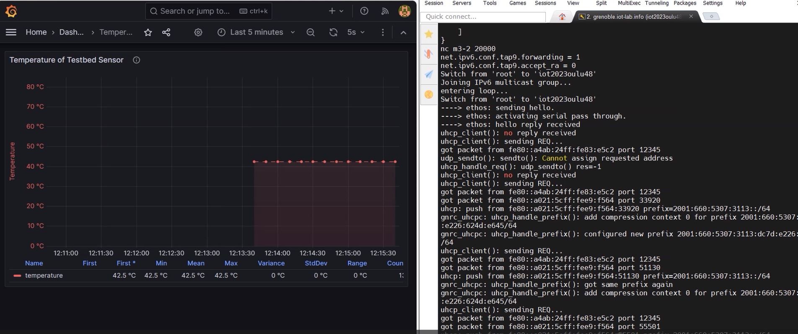
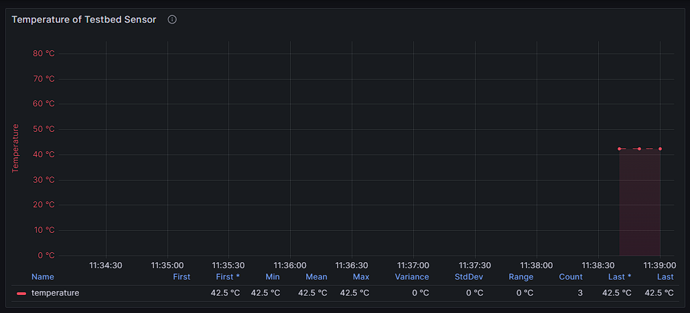
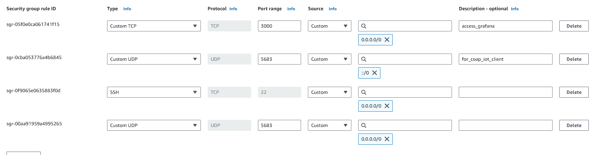
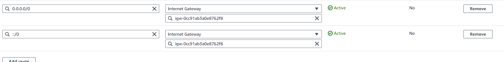

# IOT-mini-project-1

## Introduction to Project

### Description

For our University of Oulu IoT course project, we implemented a basic IoT pipeline using FIT IOT-LAB's remote MCU testbed. Our project focuses on a simple pipeline to get temperature data to cloud and visualize:

Functionality: The sensor node provides temperature and send it to Amazon cloud via CoAP protocol to visualize.

Server: Amazon server is a coap server which saves data in `influxDB` then `grafana` visualize the data saved in influxdb [1].

Visualization: We have used a common dashboard used in IOT data visualization [1].

Technologies:
- Docker compose
- FIT IOT-LAB 
- IPv6
- InfluxDB
- Grafana
- CoAP application layer protocol

### Optimizations

- **Sensor Layer**
  
  - Sensor is reset in the beginning as a calibration to remove any residual noise accumulated in DSP units in the sensor or from a previous run.
  - MCU board is put to sleep for 5 seconds after reading each temperature data to save power.

- **Network Layer**

  - If the messages are dropped by the network CoAP protocol retransmit the messages by its nature.
  - CoAP uses `UDP` as a trasport layer protocol which reduces overhead of keeping connections 
  - Data transmitted as an integer and only in the server divided by 100 to convert to float before saving to database.

- **Data Layer**

  - InfluxDB is a database optimized for time series data. It is also an NoSQL database which peforms better in IOT applications.
  - Because this is a test project security is not much considered but the setup allows to easily have secure connection with the server
  - Whole server side is containerized and grafana and influxdb is also used via docker containers making it is easy to deploy

### Project Demo

## How to install

### server

#### IPv6 enabled amazon EC2 instance

- Get an IPv6 enabled amazon instance (Ubuntu preferred as we are using docker-compose) [2]

  - follow the link [Amazon Docs : ipv6-addressing](https://docs.aws.amazon.com/AWSEC2/latest/UserGuide/using-instance-addressing.html#ipv6-addressing)
  - Remember to add inbound rules and routing table

##### Inbound Rules

  

  This is okay for a production environment. And you only have to enable UDP for IPv6 sources. For security you may want to add specific source addresses.

 ##### IPv6 Routing

 
- Install docker and docker compose plugin [3]
    If you are using an recommended ubunutu server you can run the script to install docker and all the tools

        server\amazon_ubuntu_docker_install.sh

- After that you can clone this repository inside amazon EC2 instance
  - cd into server folder
  - use docker compose

        cd server
        docker compose up --build -d

  - grafana dashboard and data influxdb are already setup via docker compose
  - Use `http://instanece_address_public_ip4:3000` from your brower to access grafana
  - default user name and password is `admin`
  - Choose the `Temperature` dashboard

### Testbed
- Get ssh access to frontend
- login to grenoble site
- clone the repository
- cd into repository folder
- In the `sensor\main.c` add your EC2 instance public IPv6 addrss
    `coap_command[i++] = "mention_your_ipv6_here";`
    eg:
        `coap_command[i++] = "2600:1234:1234:1234:1234:1234:1234:1234";`
- Then run `all.sh`
    - This builds the sensor code with new ip address
    - Star the border router (already built)

- After building one time you can run
    `start.sh`

References:

-  [1] Dashboard and server is inspired from the project [cn1-impl-opt-coap](https://github.com/cwc-ns/cn1-impl-opt-coap)
- [2] <https://docs.docker.com/engine/install/ubuntu/>
- [3] [Configure IPv6 for AWS EC2 Instance : YouTube](https://www.youtube.com/watch?v=N4S6UjR6gUY)